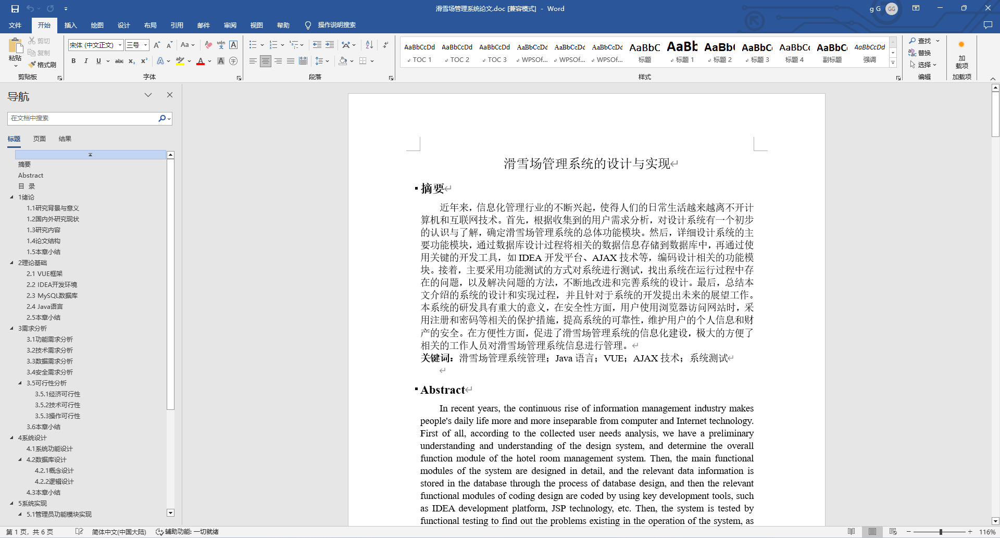
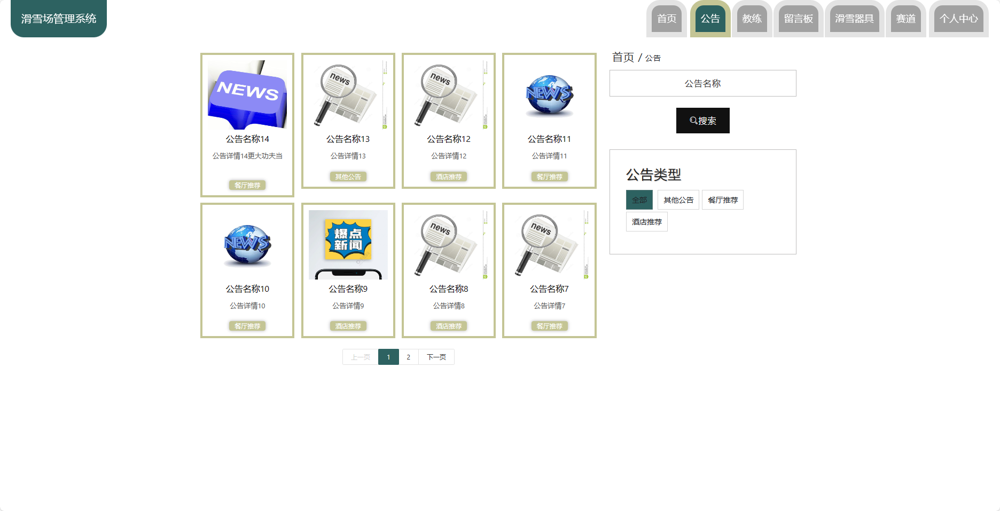
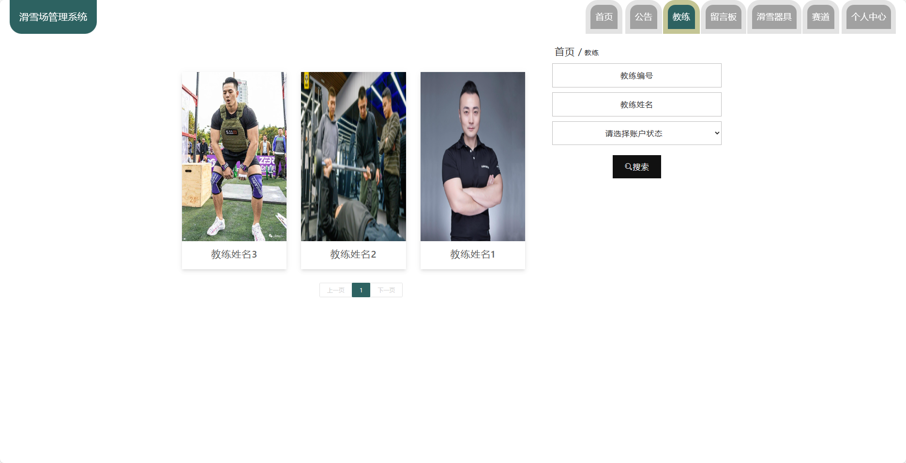
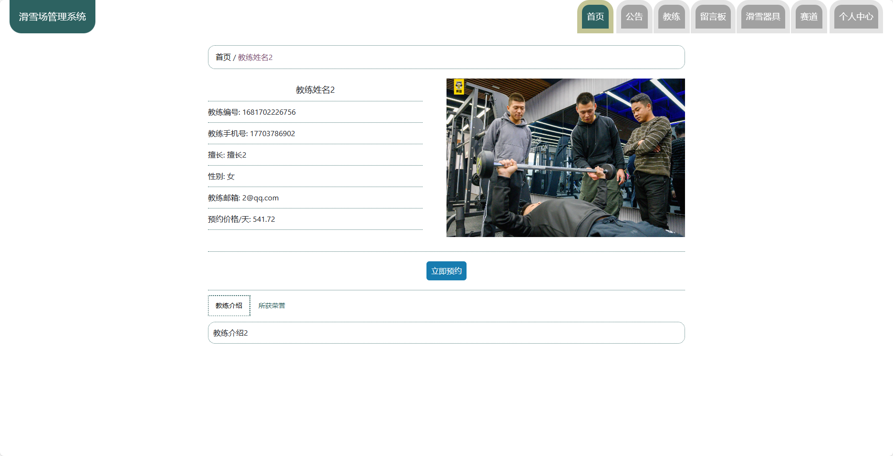
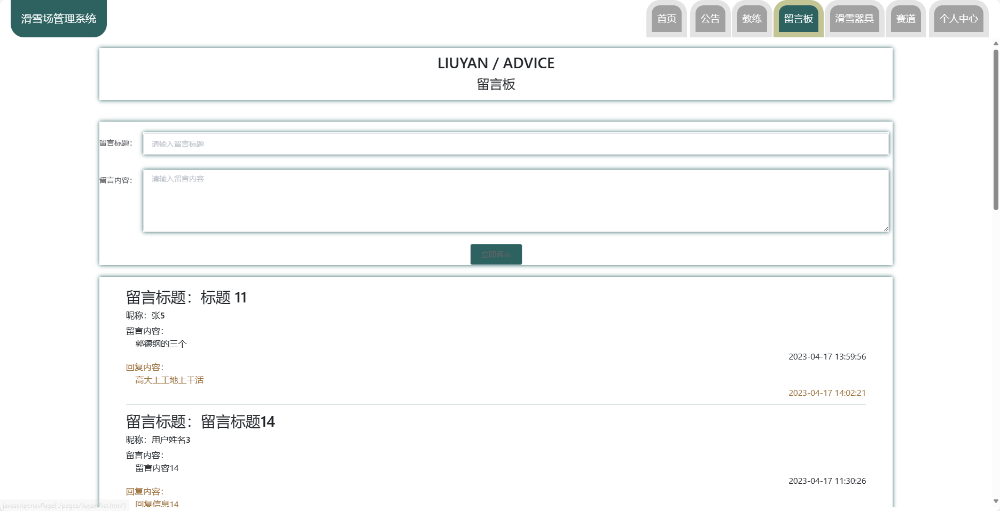
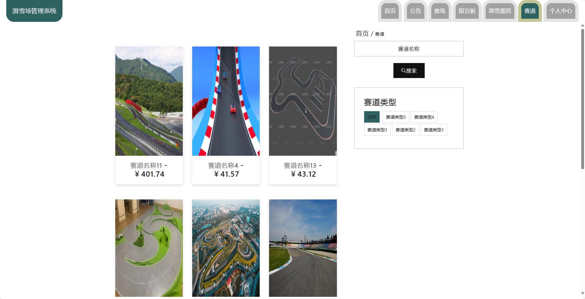
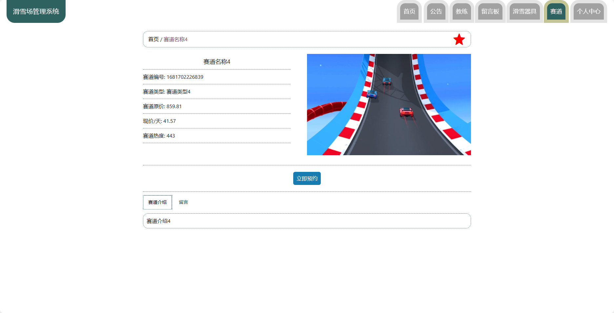
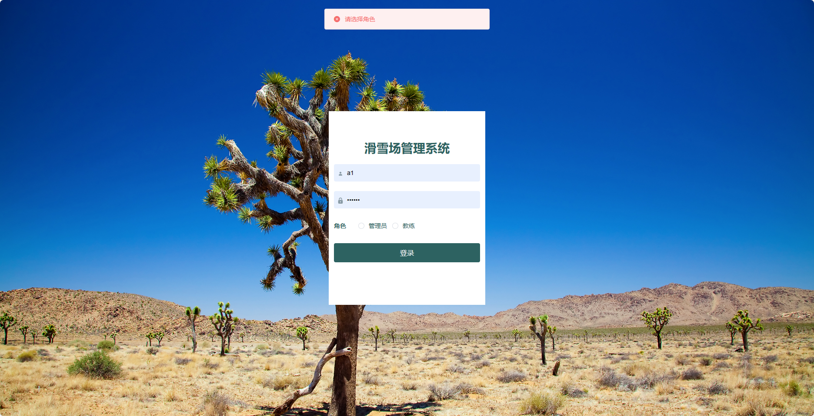

基于Springboot的滑雪场管理系统（程序+论文）
=
### 完整代码获取地址：从戎源码网 ([https://armycodes.com/](https://armycodes.com/))
### 作者微信：19941326836  QQ：952045282 
### 承接计算机毕业设计、Java毕业设计、Python毕业设计、深度学习、机器学习
### 选题+开题报告+任务书+程序定制+安装调试+论文+答辩ppt 一条龙服务
### 所有选题地址https://github.com/nature924/allProject

一、项目介绍
---
基于Spring Boot框架实现的滑雪场管理系统，系统包含两种角色：管理员、用户,系统分为前台和后台两大模块，主要功能如下。

### 前台：
- 首页：展示系统的概览信息。
- 公告：查看滑雪场发布的公告。
- 教练：了解滑雪场的教练信息。
- 留言板：与其他用户进行交流和留言。
- 滑雪器具：浏览可租借的滑雪器具信息。
- 赛道：了解滑雪场提供的赛道信息。
- 个人中心：管理个人信息。

### 后台（管理员）：
- 教练：
  - 个人中心：管理个人信息。
  - 公告管理：发布和管理公告信息。
  - 我的预约：查看和管理教练的预约情况。

- 管理员：
  - 个人中心：管理个人信息。
  - 管理员管理：管理其他管理员账户。
  - 基础数据管理：管理系统的基础数据。
  - 公告管理：发布和管理公告信息。
  - 留言板管理：管理留言板的内容。
  - 教练管理：管理滑雪场的教练信息。
  - 滑雪器具管理：管理滑雪场的器具信息。
  - 赛道管理：管理滑雪场的赛道信息。
  - 用户管理：管理系统的用户信息。
  - 轮播图信息：管理首页轮播图的展示信息。

二、项目技术
---
- 编程语言：Java
- 数据库：MySQL
- 项目管理工具：Maven
- 前端技术：VUE、HTML、Jquery、Bootstrap
- 后端技术：Spring、SpringMVC、MyBatis

三、运行环境
---
- 操作系统：Windows、macOS都可以
- JDK版本：JDK1.8以上都可以
- 开发工具：IDEA、Ecplise、Myecplise都可以
- 数据库: MySQL5.7以上都可以
- Tomcat：任意版本都可以
- Maven：任意版本都可以

四、运行截图
---
### 论文截图：

### 程序截图：

